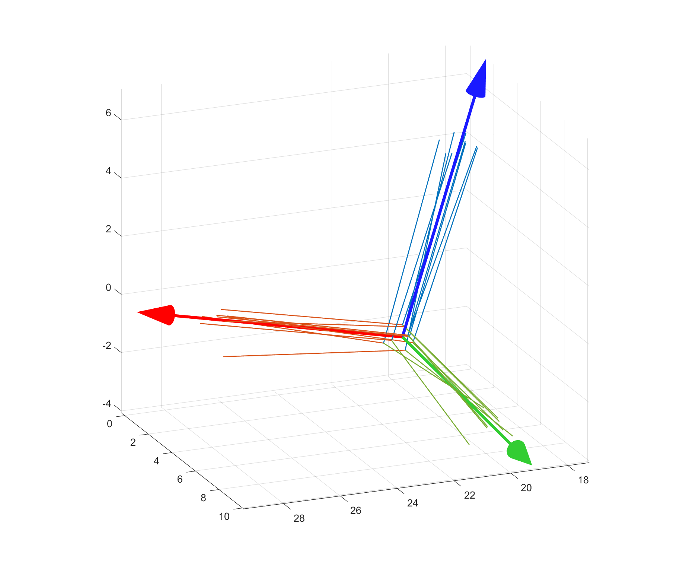

# Average-SE3
 Average homogeneous transformation Matrix


Average of a position is easy. But how about rotation?

```matlab
avg_pos = AvgSE3(rot,tran);
avg_pos = AvgSE3(rot,tran,w);
```


**Input:** 

- rot: 3\*3\*n SO3 Matrix or n\*4 quat
- tran: 3\*n or 3\*1\*n Position Column Vector


**Optional Input**

- w: 1*n weight vector


For detail please check: <u>demo_Average_Transformation.mlx</u>


